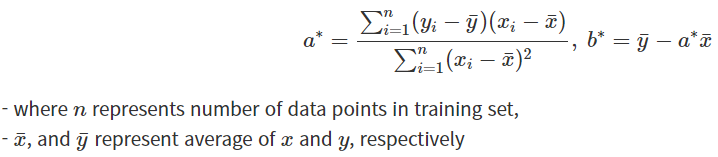

- 데이터를 가장 잘 나타내는 직선을 찾는 분석 기법


공부한 시간(x) = [2,4,6,8]

성적(y) 			= [81,93,91,97]


- f(x)=ax+b로 표현

  a: 기울기, b: 절편


### 최소 제곱법(method of least squares)

- a,b를 구하기 위해서 여러가지 방법 중 하나



- 한계

최소제곱법으로는 여러 개 입력을 처리하기에는 연산비용이 매우 커서 사용하기 힘들다.

=> 그래서 RMSE같은 평가방법를 통해 선을 조금씩 수정해 나가며 선을 찾는다.


---


> ### 손으로 풀기

- a 구하기

x평균: (2+4+6+8)/4 = 5

y평균: (81+93+91+97)/4 = 90.5

위 식에 대입하면

(2-5)(81-90.5)+(4-5)(93-90.5)+(6-5)(91-90.5)+(8-5)(97-90.5)

/

(2-5)^2 + (4-5)^2 + (6-5)^2 + (8-5)^2

= 46/20 = 2.3

> a = 2.3

- b 구하기

90.5 - 2.3*5 = 79

> b = 79

f(x) = 2.3x + 79

---


> ### 코드

```python
import numpy as np 

# x 값과 y 값
x = [2, 4, 6, 8]
y = [81, 93, 91, 97]

mx, my = np.mean(x), np.mean(y)

# 분모
divisor = sum([(xi-mx)**2 for xi in x])

# 분자
def top(x, mx, y, my):
    d = 0
    for i in range(len(x)):
        d += (x[i]-mx) * (y[i]-my)
    return d
dividend = top(x, mx, y, my)

print("분모: ", divisor)
print("분자: ", dividend)

a = dividend/divisor
b = my - (a*mx)

print("기울기 a =" , a)
print("y 절편 b =" , b)
```


### 평균 제곱근 오차

(Root Mean Square Error)

오차를 평가하는 방법

> ### 코드

```python
# 임의의 기울기와 절편
random_a_b = [3, 76]
X = np.array([2, 4, 6, 8])
y = np.array([81, 93, 91, 97])

def predict(X):
    return random_a_b[0]*X+random_a_b[1]

def rmse(X, y):
    return np.sqrt(((y-predict(X))**2).mean())

rmse(X,y)
# 3.3166
```


