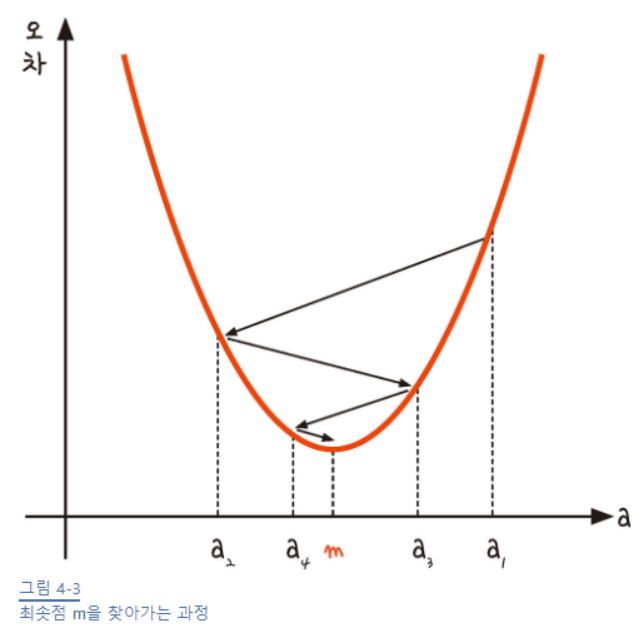
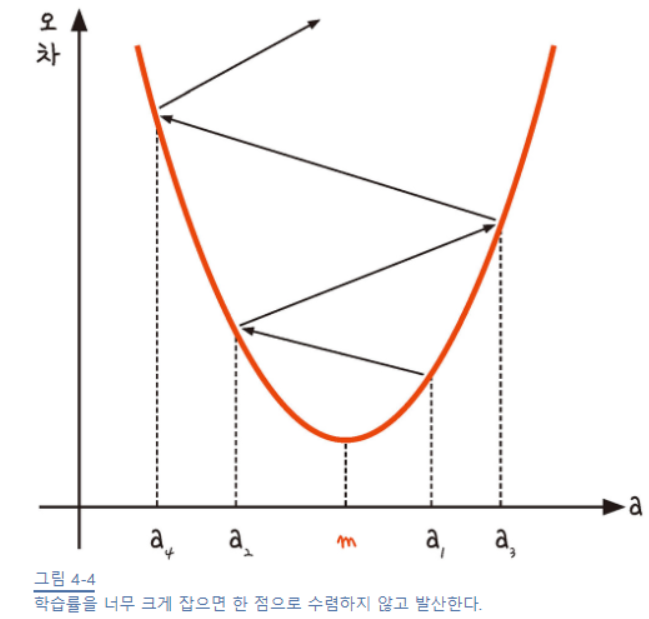
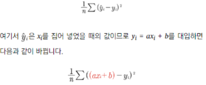
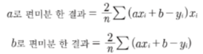
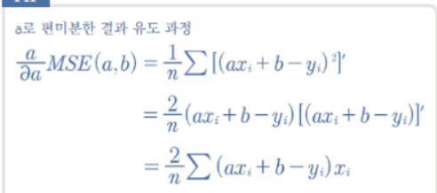
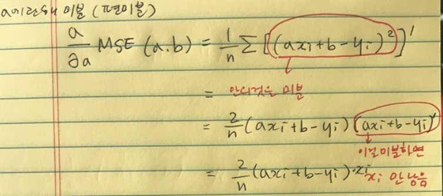
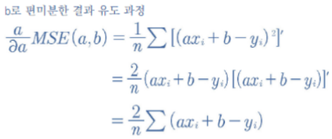
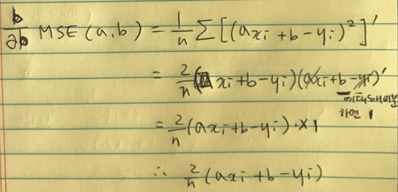
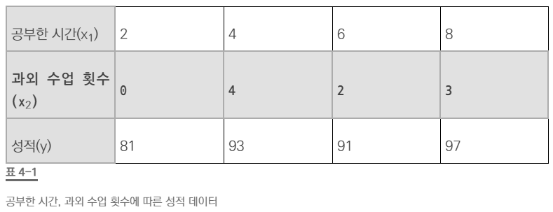

비용 함수가 가장 최소 지점을 찾는게 목표


1. a1에서 미분을 구함
2. 구해진 기울기의 반대 방향(기울기가 +면 음의 방향, -면 양의 방향)으로 얼마간 이동시킨 a2에서 미분을 구함
3. 위에서 구한 미분 값이 0일 때까지 위 과정을 반복



- 기울기의 부호를 바꿔서 이동시킬때, 적절한 거리(학습률)를 찾지 못하면 a 값이 위로 치솟아버린다.




비용 함수를 `평균제곱오차`로 쓸 때 경사하강을 해보자

1. 평균제곱오차를 미분
2. 경사하강법, 랜덤 a에서 극소점인 m을 찾으러 움직이자


#### 평균제곱오차를 미분





*chain rule(합성함수의 미분, 연쇄법칙)에 대한 지식이 있어야 함!





[출처:https://m.blog.naver.com/PostView.nhn?blogId=chai1226&logNo=221904213160&navType=tl]






> #### 코드

```python
y_pred = a * x_data + b #오차 함수인 y = ax + b를 정의한 부분

error = y_data - y_pred #실제값 – 예측값, 즉 오차를 구하는 식 

 # 평균 제곱 오차를 a로 미분한 결과 
a_diff = -(2 / len(x_data)) * sum(x_data * (error)) 

# 평균 제곱 오차를 b로 미분한 결과 
b_diff = -(2 / len(x_data)) * sum(y_data - y_pred)
```


#### 경사하강법, 랜덤 a에서 극소점인 m을 찾으러 움직이자

> ### 코드

```python
import numpy as np 
import pandas as pd 
import matplotlib.pyplot as plt  

# 공부 시간 X와 성적 Y의 리스트를 만들기 
data = [[2, 81], [4, 93], [6, 91], [8, 97]] 
x = [i[0] for i in data] y = [i[1] for i in data]  

# 그래프로 나타내기 
plt.figure(figsize=(8,5)) plt.scatter(x, y) plt.show()

# 리스트로 되어 있는 x와 y 값을 넘파이 배열로 바꾸기(인덱스를 주어 하나씩 불러와 계산이 가능하게 하기 위함) 
x_data = np.array(x) y_data = np.array(y)  

# 기울기 a와 절편 b의 값 초기화 
a = 0 b = 0  

# 학습률 정하기 
lr = 0.05  

# 몇 번 반복될지 설정(0부터 세므로 원하는 반복 횟수에 +1) epochs = 2001 

# 경사 하강법 시작 
for i in range(epochs):  # 에포크 수만큼 반복     
     y_pred = a * x_data + b  # y를 구하는 식 세우기
     error = y_data - y_pred  # 오차를 구하는 식
     # 오차 함수를 a로 미분한 값
     a_diff = -(1/len(x_data)) * sum(x_data * (error))
     # 오차 함수를 b로 미분한 값
     b_diff = -(1/len(x_data)) * sum(y_data - y_pred)
     a = a - lr * a_diff # 학습률을 곱해 기존의 a값 업데이트
     b = b - lr * b_diff # 학습률을 곱해 기존의 b값 업데이트
     if i % 100 == 0:    # 100번 반복될 때마다 현재의 a값 , b값 출력 
        print("epoch=%.f, 기울기=%.04f, 절편=%.04f" % (i, a, b)) 

 # 앞서 구한 기울기와 절편을 이용해 그래프를 다시 그리기
 y_pred = a * x_data + b plt.scatter(x, y)
 plt.plot([min(x_data), max(x_data)], [min(y_pred), max(y_pred)])
 plt.show()
```


#### 다중 선형 회귀에서의 경사하강



> 변수 하나 더 늘었을 뿐, 편미분은 과정은 똑같다.


> ### 코드

```python
import numpy as np 
import pandas as pd
import matplotib.pyplot as plt
from mpl_toolkits import mplot3d

#공부시간 X와 성적 Y의 리스트 만들기
data = [[2, 0, 8], [4, 4, 93], [6, 2, 91], [8, 3, 97]]
x1 = [i[0] for i in data]
x2 = [i[1] for i in data]
y = [i[2] for i in data]

#그래프로 확인
ax = plt.axes(projection='3d')
ax.set_xlabel('study_hours')
ax.set_ylabel('private_class')
ax.set_zlabel('Score')
ax.dist = 11
ax.scatter(x1, x2, y)
plt.show()

#리스트로 되어 있는 x와 y값을 넘파이 배열로 바꾸기 (인덱스로 하나씩 불러와 계산할 수 있도록 하기 위함)
x1_data = np.array(x1)
x2_data = np.array(x2)
y_data = np.array(y)

#기울기 a와 절편 b의 값 초기화
a1 = 0
a2 = 0
b = 0

#학습률
lr = 0.05

#몇 번 반복할지 설정 ( 0부터 세므로 원하는 반복 횟수에 +1 )
epochs = 2001

#경사 하강법 시작
for i in range(epochs):    #epoch 수 만큼 반복
    y_pred = a1 * x1_data + a2 * x2_data +b     #y를 구하는 식 세우기
    error = y_data - y_pred   #오차를 구하는 식   
    #오차 함수를 a1로 미분한 값
    a1_diff = -(1/len(x1_data)) * sum(x1_data * (error))
    #오차 함수를 a2로 미분한 값
    a2_diff = -(1/len(x2_data)) * sum(x2_data * (error))
    #오차 함수를 b로 미분한 값
    b_diff = -(1/len(x1_data)) * sum(y_data - y_pred)

    a1 = a1 - lr * a1_diff        #학습률을 곱해 기존의 a1값 업데이트
    a2 = a2 - lr * a2_diff        #학습률을 곱해 기존의 a2값 업데이트
    b = b - lr * b_diff           #학습률을 곱해 기존의 b값 업데이트
    
    if i % 100 == 0:
        print("epoch=%.f, 기울기1=%.04f, 기울기2=%.04f, 절편=%.04f" % (i, a1, a2, b))
```
