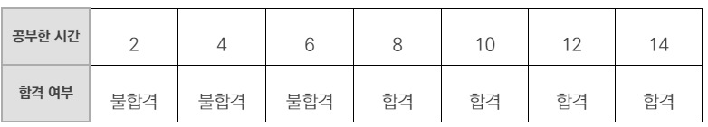
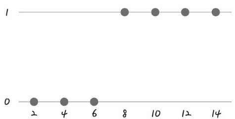
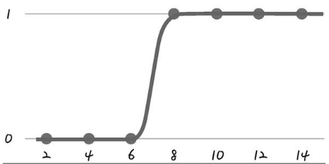
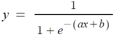
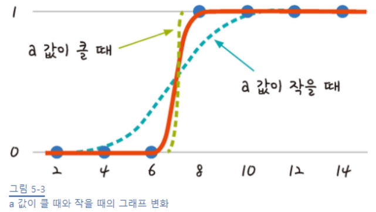
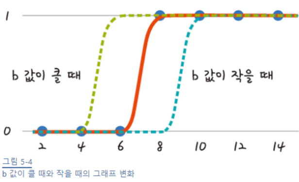
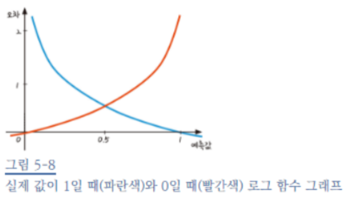
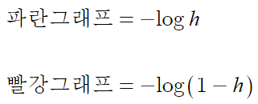
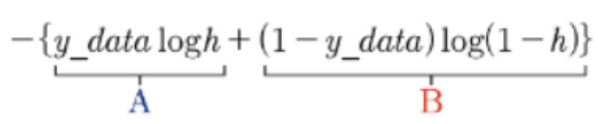

공부시간에 따른 합격 여부 데이터



데이터를 그림으로 표현하면 아래와 같다.





데이터를 가장 잘 나타내는 선은?



이를 잘 나타내는 함수가 존재


- 시그모이드 함수

Sigmoid function







경사하강법을 통해서 a,b를 찾아내자

회귀에서는 MSE오차를 사용했지만 로지스틱에서는 로그함수 오차를 사용함





그래프를 이해해보자

실제값이 1인데 예측값이 1이면 오차가 0이 되어야 데이터를 잘 나타낸 오차함수 일 것이다.

파란색일 경우 실제값이 1인데 예측값이 1이니 오차가 0이 되는 함수이니 알맞은 오차함수라 할 수 있다.

빨간색일 경우도 마찬가지이다. 실제 0이고 예측값이 0일 때 오차가 가장작은 빨간색 함수가 알맞은 오차함수이다.  위 두 함수를 하나의 식으로 표현가능



실제값 y_data가 1이면 B부분이 없어지고 A식을 통해 원래 파란그래프 오차함수를 따름


> #### 코드

```python
import numpy as np
import pandas as pd
import matplotlib.pyplot as plt

#### Dataset #### 
#공부 시간 X와 합격 여부 Y의 리스트 만들기
data = [[2, 0], [4, 0], [6, 0], [8, 1], [10, 1], [12, 1], [14, 1]]
x_data = [i[0] for i in data]
y_data = [i[1] for i in data]


#### Params ####
#기울기 a와 절편 b의 값 초기화
a = 0
b = 0
#학습률
lr = 0.05


#그래프로 나타내기
plt.scatter(x_data, y_data)
plt.xlim(0, 15)
plt.ylim(-.1, 1.1)

#### Functions ####
#시그모이드 함수 정의
def sigmoid(x):
    return 1 / (1 + np.e ** (-x))


#### Trn ####
#경사 하강법 실행
#1000번 반복될 때 마다 각 x_data 값에 대한 현재의 a 값, b 값 출력
for i in range(2001):
    for x_data, y_data in data:
        a_diff = x_data*(sigmoid(a * x_data + b) - y_data) #a에 대한 편미분
        b_diff = sigmoid(a *x_data + b) - y_data #b에 대한 편미분
        a = a - lr * a_diff
        b = b - lr * b_diff
        if i % 1000 == 0:
            print("epoch=%.f, 기울기=%.04f, 절편=%.04f" % (i, a, b))

#앞서 구한 기울기와 절편을 이용해 그래프 그리기
plt.scatter(x_data, y_data)
plt.xlim(0, 15)
plt.ylim(-.1, 1.1)
x_range = (np.arange(0, 15, 0.1))    #그래프로 나타낼 x값의 범위 정하기
plt.plot(np.arange(0, 15, 0.1), np.array([sigmoid(a * x + b) for x in x_range]))
plt.show
```