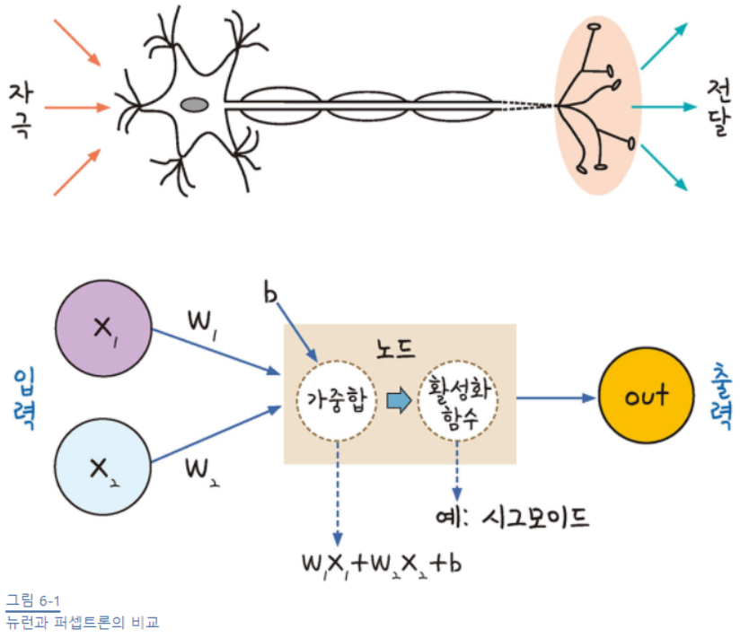
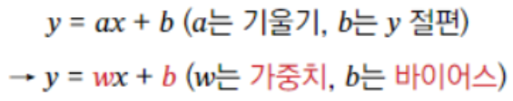
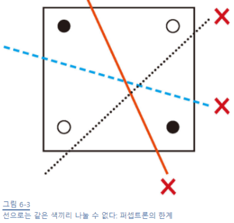
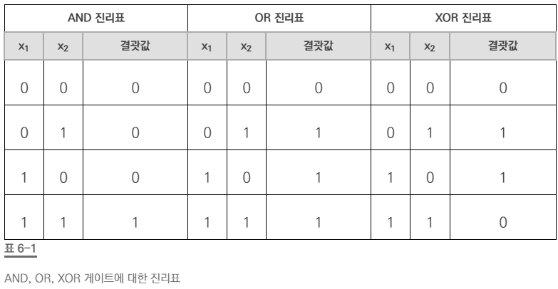
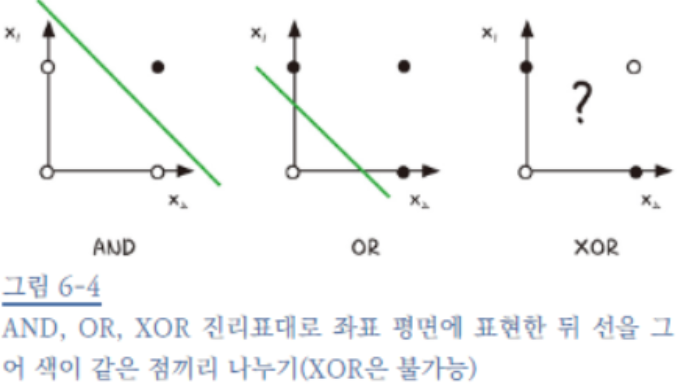

# 퍼셉트론

인간의 뇌(신경망)는 1000억개가 넘는 뉴런으로 이루어짐

뉴런과 뉴런사이에는 시냅스로 연결됨

시냅스가 특정한 값이 넘으면 다음 뉴런으로 신호가 전달됨

(뉴런 -> 신경망 -> 지능)

이를 본 따 

입력 값과 활성화 함수를 사용해 출력 값을 다음으로 넘기는 것을 퍼셉트론(Perceptron)이라 부름

퍼센트론을 기본 단위를 가지는 1개 이상의 퍼셉트론이 인공 신경망(Artificail Neural Network, ANN)임

# 가중치, 가중합, 바이어스, 활성화 함수

가중합(weighted sum) = 가중치(W) x 입력값(X) + 바이어스(b)

활성화 함수 = 가중합의 결과를 특정 값으로 변형하는 함수(ex, 시그모이드)

# 퍼셉트론의 과제

1개의 퍼셉트론으로는 해결못하는 문제가 있음

# XOR 문제

위 그림이 XOR 문제를 표현한 것

XOR은 논리 회로에 등장하는 개념

컴퓨터가 두 가지의 디지털 값(0,1)을 받아 하나의 값을 출력하는 회로가 모여 만들어짐

AND회로는 x1, x2 둘다 1일 때 결과값이 1로 출력

OR회로는 둘 중 하나라도 1이면 결괏값이 1로 출력

XOR회로는 둘 중 하나만 1일 때 1이 출력됩니다.

XOR문제는 하나의 선(뉴런)으로 표현 할 수 없음

뉴런을 본 따 퍼셉트론을 만들었지만 XOR문제조차 해결할 수 없음

-> 다층 퍼셉트론으로 해결함